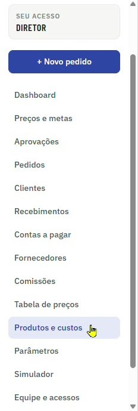

[Manual](../README.md) / Primeiros passos

# Navegação e menu

Onde fica cada função no menu lateral e os atalhos comuns a todas as telas.

**Índice**

1. Menu lateral
2. Botão Novo pedido
3. Listas, abas e busca

## Menu lateral

O menu fica à esquerda em todas as telas. Ele mostra apenas os itens liberados para o seu perfil.

*Menu lateral no perfil Diretoria, com o card Seu acesso e o botão + Novo pedido*

| Item | Para que serve |
| --- | --- |
| Dashboard | Visão geral de vendas, funil, lucro e ranking. |
| Preços e metas | Metas de venda e acompanhamento da tabela. |
| Aprovações | Pedidos que pediram aprovação por desconto ou entrada. |
| Pedidos | Todos os pedidos e orçamentos. |
| Clientes | Cadastro de clientes. |
| Recebimentos | Parcelas a receber e recebidas. |
| Contas a pagar | Despesas e pagamentos da empresa. |
| Fornecedores | Fábricas, assessoria e prestadores. |
| Comissões | Comissão de cada vendedor por mês. |
| Tabela de preços | Preços publicados para a equipe. |
| Produtos e custos | Equipamentos e custos da assessoria. |
| Parâmetros | Impostos, canal e política comercial. |
| Simulador | Simulação de preço e desconto sem criar pedido. |
| Equipe e acessos | Usuários e perfis. |

## Botão Novo pedido

O botão **\+ Novo pedido** fica sempre no topo do menu. Ele abre a tela de [lançamento de pedidos](04-novo-pedido.md) de qualquer lugar do sistema.

## Listas, abas e busca

1.  As listas têm abas no topo para filtrar por situação, por exemplo **Em aberto**, **Fechados** e **Todos**. O número ao lado de cada aba mostra quantos registros ela tem.
2.  O campo de busca procura por nome, código, CNPJ ou CPF, conforme a tela.
3.  Os números das listas e dos cards se atualizam sozinhos a cada pedido.

---
*Atualizado em 04/10/2026 · Ávila Ops Tecnologia*
