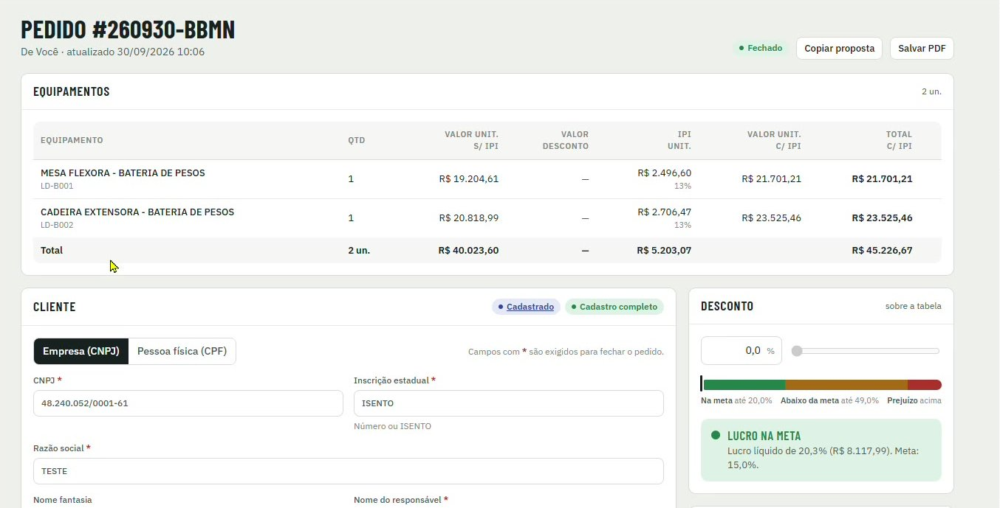
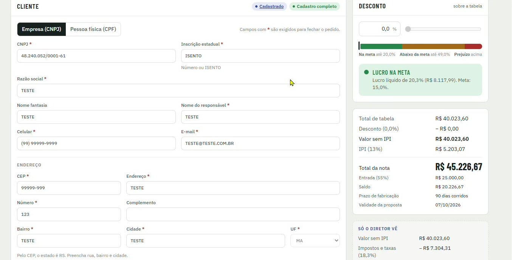
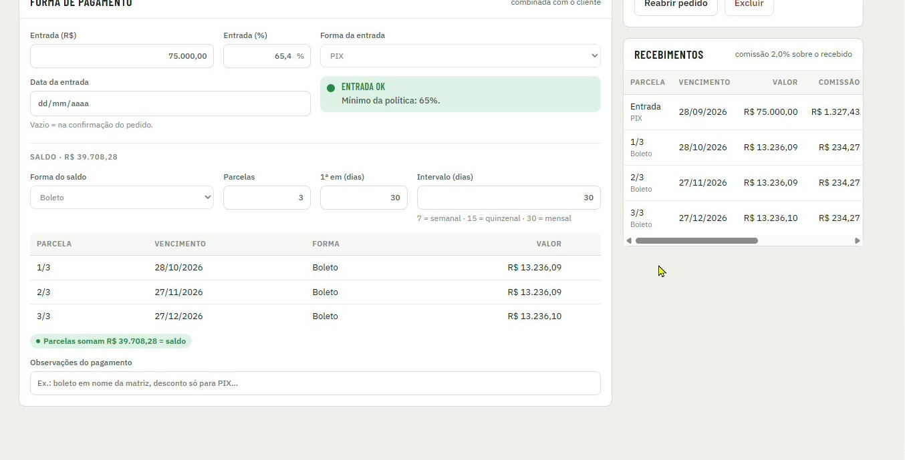
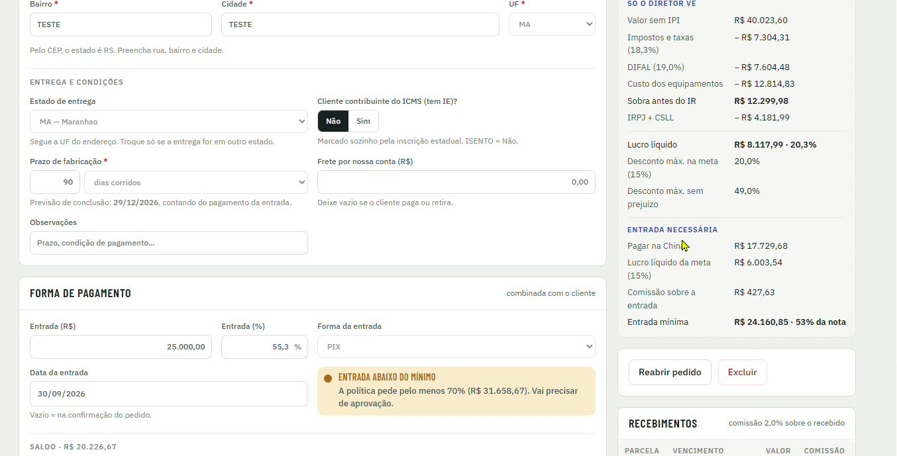
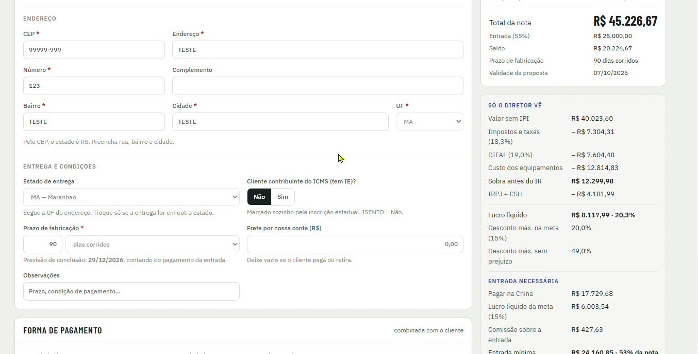

[Manual](../README.md) / Comercial

# Lançamento de pedidos

Como montar um orçamento, aplicar desconto, combinar a forma de pagamento e fechar o pedido.

**Índice**

1. Abrir um novo pedido
2. Equipamentos
3. Cliente
4. Entrega e condições
5. Desconto e resumo
6. Forma de pagamento
7. Quadro Só o diretor vê
8. Fechar, copiar e salvar a proposta

## Abrir um novo pedido

Para lançar um pedido, clique em **\+ Novo pedido** no topo do menu ou na tela **Pedidos**.

O pedido recebe um número no formato `#AAMMDD-XXXX`, por exemplo #260930-BBMN, e fica salvo enquanto você preenche.

*Cabeçalho do pedido com número, situação, botões Copiar proposta e Salvar PDF e a lista de equipamentos*

## Equipamentos

1.  Busque o equipamento pelo nome ou pelo código (ex.: LD-B001) e informe a quantidade.
2.  A tabela mostra, para cada item: valor unitário sem IPI, valor do desconto, IPI unitário (13%), valor unitário com IPI e total com IPI.
3.  A linha **Total** soma as unidades e os valores do pedido.

## Cliente

Escolha a aba **Empresa (CNPJ)** ou **Pessoa física (CPF)**. Campos com \* são exigidos para fechar o pedido, mas o orçamento pode ser salvo antes.

*Bloco Cliente com a aba Empresa (CNPJ), o controle de desconto e o resumo de valores*

1.  **Empresa:** CNPJ, inscrição estadual (número ou ISENTO), razão social, nome fantasia, nome do responsável, celular e e-mail.
2.  **Pessoa física:** nome completo, CPF, RG, celular e e-mail.
3.  **Endereço:** informe o CEP. O sistema identifica o estado; complete rua, número, bairro e cidade.
4.  Os selos **Cadastrado** e **Cadastro completo** indicam que o cliente já existe e que todos os campos obrigatórios estão preenchidos.

## Entrega e condições

1.  **Estado de entrega:** segue a UF do endereço. Troque só se a entrega for em outro estado. Ele define o ICMS e o DIFAL da venda.
2.  **Cliente contribuinte do ICMS (tem IE)?** É marcado sozinho pela inscrição estadual: ISENTO ou pessoa física fica como **Não**.
3.  **Prazo de fabricação:** em dias corridos, contados a partir do pagamento da entrada. O sistema mostra a previsão de conclusão.
4.  **Frete por nossa conta (R$):** deixe vazio se o cliente paga ou retira.
5.  **Observações:** prazo, condição de pagamento ou qualquer combinado com o cliente.

## Desconto e resumo

O desconto é aplicado sobre a tabela, em %, pelo campo ou pela barra deslizante. A faixa colorida mostra a situação do pedido:

| Faixa | Significado |
| --- | --- |
| Na meta | O lucro líquido do pedido fica igual ou acima da meta (15%). |
| Abaixo da meta | O pedido dá lucro, mas abaixo da meta. Precisa de aprovação. |
| Prejuízo | O desconto passa do ponto sem lucro. |

O resumo ao lado mostra total de tabela, desconto, valor sem IPI, IPI, total da nota, entrada, saldo, prazo de fabricação e validade da proposta.

> **Observação**
>
> Os limites de cada faixa mudam conforme o estado de entrega e os equipamentos do pedido. O desconto livre do vendedor é definido em [Parâmetros](16-parametros.md).

## Forma de pagamento

*Forma de pagamento com entrada, saldo parcelado em boleto e a lista de recebimentos com a comissão de cada parcela*

1.  Informe a **entrada** em R$ ou em %, a **forma da entrada** (ex.: PIX) e a **data da entrada**. Vazio significa na confirmação do pedido.
2.  O sistema compara a entrada com a política:
    -   **Entrada OK**: a entrada cobre o mínimo da política.
    -   **Entrada abaixo do mínimo**: o pedido vai precisar de aprovação. O aviso mostra o valor mínimo.
3.  No **saldo**, escolha a forma (ex.: boleto), o número de parcelas, quando vence a 1ª (em dias) e o intervalo entre parcelas: 7 = semanal, 15 = quinzenal, 30 = mensal.
4.  Confira a mensagem **Parcelas somam R$ ... = saldo**. Use **Observações do pagamento** para combinados como "boleto em nome da matriz".
5.  O bloco **Recebimentos** lista as parcelas com vencimento, valor e a comissão de 2,0% de cada uma.

*Aviso de entrada abaixo do mínimo: o pedido precisará de aprovação*

## Quadro Só o diretor vê

Este quadro aparece apenas para a diretoria. Ele abre a conta do pedido:

*Quadro Só o diretor vê em uma venda para o Maranhão, com DIFAL e a entrada necessária*

| Linha | O que mostra |
| --- | --- |
| Impostos e taxas | ICMS, PIS/COFINS, comissão, anúncios e taxas do canal, em R$ e %. |
| DIFAL | Aparece nas vendas para fora de SP. Ver [ICMS e DIFAL](21-regra-difal.md). |
| Custo dos equipamentos | Custo real, já com a margem de segurança da importação. |
| Sobra antes do IR e IRPJ + CSLL | Resultado antes do imposto de renda e o imposto sobre o lucro. |
| Lucro líquido | Valor e percentual final do pedido. |
| Desconto máx. na meta e sem prejuízo | Até onde o desconto pode ir mantendo a meta ou sem prejuízo. |
| Entrada necessária | Valor a pagar na China, lucro da meta, comissão sobre a entrada e a entrada mínima. Ver [Entrada mínima](20-regra-entrada.md). |

## Fechar, copiar e salvar a proposta

1.  Com os campos obrigatórios preenchidos e dentro da política, feche o pedido. Fora da política, ele vai para **Aprovações**.
2.  **Copiar proposta** copia o texto do orçamento para enviar ao cliente pelo WhatsApp ou e-mail.
3.  **Salvar PDF** gera o orçamento em PDF com a marca da Ludus.
4.  Em um pedido fechado, **Reabrir pedido** volta o pedido para edição e **Excluir** remove o pedido.

> **Atenção**
>
> Reabrir um pedido fechado recalcula só as parcelas ainda não recebidas. Valores já recebidos e as comissões geradas por eles não mudam; qualquer acerto sobre eles entra como um lançamento de ajuste, com o motivo.

---
*Atualizado em 04/10/2026 · Ávila Ops Tecnologia*
