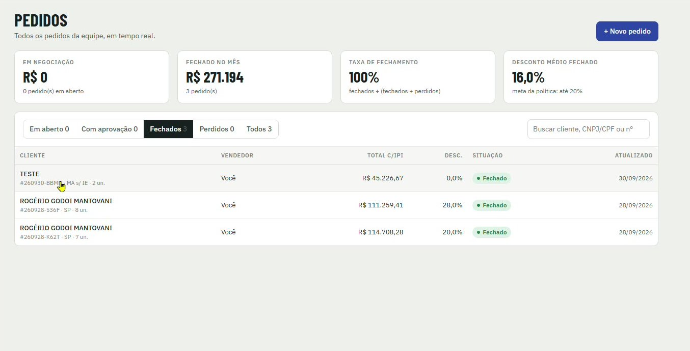

[Manual](../README.md) / Comercial

# Lista de pedidos

Como acompanhar todos os pedidos e orçamentos da equipe e encontrar um pedido.

**Índice**

1. Indicadores do topo
2. Abas de situação
3. Buscar e abrir um pedido

Acesse o menu **Pedidos**. A tela mostra todos os pedidos da equipe em tempo real. O vendedor vê apenas os próprios.

*Lista de pedidos com os indicadores do mês e a aba Fechados selecionada*

## Indicadores do topo

| Card | O que mostra |
| --- | --- |
| Em negociação | Valor e quantidade de pedidos em aberto. |
| Fechado no mês | Total vendido no mês e número de pedidos. |
| Taxa de fechamento | Fechados ÷ (fechados + perdidos). |
| Desconto médio fechado | Média dos descontos dos pedidos fechados, comparada à meta da política (até 20%). |

## Abas de situação

**Em aberto**, **Com aprovação**, **Fechados**, **Perdidos** e **Todos**. Cada linha mostra cliente, número do pedido, UF, vendedor, total com IPI, desconto, situação e data da última atualização.

## Buscar e abrir um pedido

1.  Digite o nome do cliente, o CNPJ/CPF ou o número do pedido no campo de busca.
2.  Clique na linha para abrir o pedido.

---
*Atualizado em 04/10/2026 · Ávila Ops Tecnologia*
