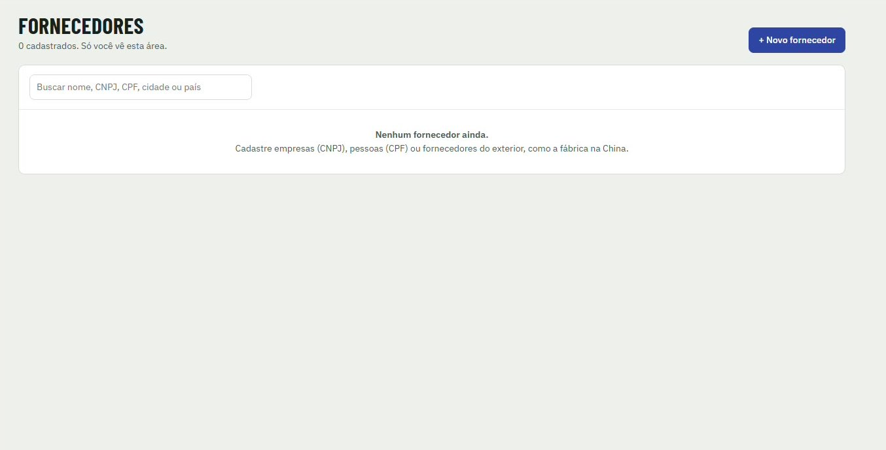

[Manual](../README.md) / Cadastros

# Cadastro de fornecedores

Como cadastrar fábricas, assessoria de importação e prestadores.

**Índice**

1. Abrir o cadastro
2. Tipos de fornecedor

Acesse o menu **Fornecedores**. Esta área é visível para a diretoria e o financeiro.

*Tela de fornecedores antes do primeiro cadastro*

## Abrir o cadastro

1.  Clique em **\+ Novo fornecedor**.
2.  Preencha os dados e salve. Use a busca por nome, CNPJ, CPF, cidade ou país para encontrar um fornecedor depois.

## Tipos de fornecedor

| Tipo | Exemplo |
| --- | --- |
| Empresa (CNPJ) | Assessoria de importação, despachante, transportadora. |
| Pessoa (CPF) | Montador ou prestador autônomo. |
| Exterior | A fábrica na China. |

---
*Atualizado em 04/10/2026 · Ávila Ops Tecnologia*
