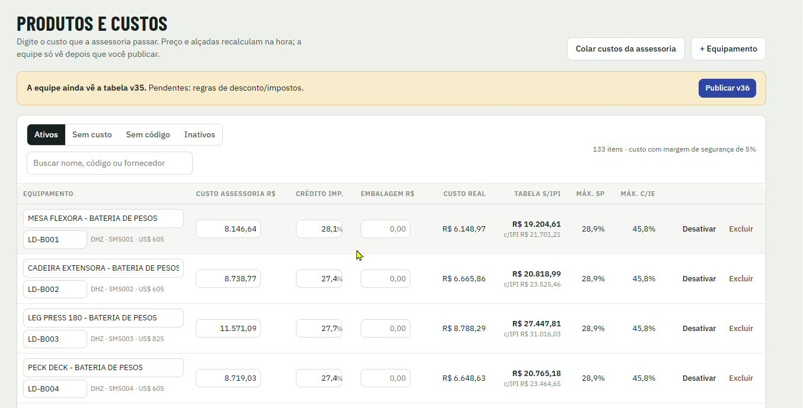

[Manual](../README.md) / Cadastros

# Produtos e custos

Como cadastrar equipamentos, lançar o custo da assessoria e publicar a tabela para a equipe.

**Índice**

1. Visão geral da tela
2. Cadastrar um equipamento
3. Lançar ou colar custos
4. Colunas da tabela
5. Publicar a tabela para a equipe
6. Desativar ou excluir

Acesse o menu **Produtos e custos**. Esta tela é exclusiva da diretoria.

*Produtos e custos com o aviso de tabela pendente e o botão Publicar*

## Visão geral da tela

Digite o custo que a assessoria passar. O preço de tabela e os descontos máximos recalculam na hora, mas a equipe só vê a mudança depois que você publicar.

1.  Abas: **Ativos**, **Sem custo**, **Sem código** e **Inativos**. Use Sem custo e Sem código para achar cadastros incompletos.
2.  Busca por nome, código ou fornecedor.
3.  O contador no canto mostra o total de itens e a margem de segurança aplicada no custo (hoje 5%).

## Cadastrar um equipamento

1.  Clique em **\+ Equipamento**.
2.  Informe o nome (ex.: MESA FLEXORA - BATERIA DE PESOS), o código Ludus (ex.: LD-B001) e a referência do fornecedor, como o modelo da fábrica e o preço em dólar.
3.  Lance o custo da assessoria e salve.

## Lançar ou colar custos

1.  Para um item, digite direto no campo **Custo assessoria R$**.
2.  Para vários itens, clique em **Colar custos da assessoria** e cole a planilha que a assessoria enviou.

## Colunas da tabela

| Coluna | O que é |
| --- | --- |
| Equipamento | Nome, código Ludus e referência do fornecedor (modelo e preço em US$). |
| Custo assessoria R$ | Custo nacionalizado informado pela assessoria. |
| Crédito imp. | Percentual de impostos que a Ludus recupera como crédito. |
| Embalagem R$ | Custo extra de embalagem, quando houver. |
| Custo real | Custo usado no cálculo, já com créditos e margem de segurança. |
| Tabela s/IPI | Preço de tabela sem IPI. O valor com IPI aparece abaixo. |
| Máx. SP | Desconto máximo mantendo a meta em uma venda dentro de SP. |
| Máx. c/IE | Desconto máximo mantendo a meta para cliente contribuinte (com inscrição estadual). |

## Publicar a tabela para a equipe

Quando há alterações não publicadas, aparece o aviso "A equipe ainda vê a tabela v35" com o que está pendente.

1.  Confira os valores.
2.  Clique em **Publicar v36**. A equipe passa a vender com a nova tabela, e a versão anterior fica guardada.

## Desativar ou excluir

1.  **Desativar** tira o equipamento da venda, mas mantém o histórico. Ele vai para a aba Inativos.
2.  **Excluir** remove o cadastro. Use só para itens lançados por engano.

---
*Atualizado em 04/10/2026 · Ávila Ops Tecnologia*
