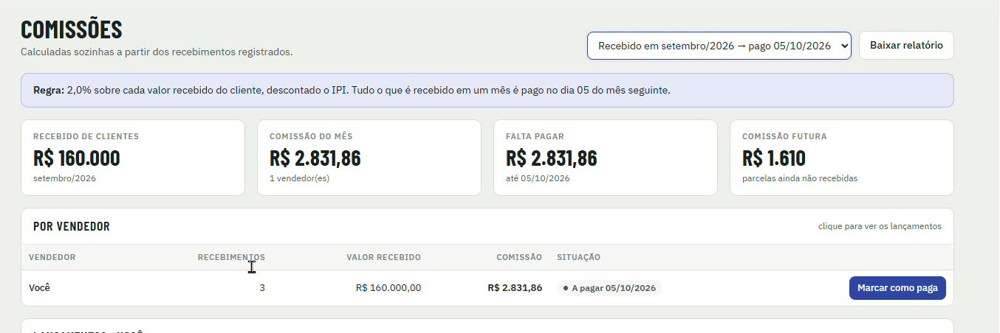

[Manual](../README.md) / Financeiro

# Comissões

Como conferir a comissão do mês de cada vendedor e marcar como paga.

**Índice**

1. Regra de comissão
2. Indicadores
3. Comissão por vendedor
4. Lançamentos
5. Baixar relatório

Acesse o menu **Comissões**. As comissões são calculadas sozinhas a partir dos recebimentos registrados.

*Comissões do mês com os indicadores, a lista por vendedor e o botão Marcar como paga*

## Regra de comissão

2,0% sobre cada valor recebido do cliente, descontado o IPI. Tudo o que é recebido em um mês é pago no dia 05 do mês seguinte. Detalhes em [Comissão dos vendedores](22-regra-comissao.md).

## Indicadores

| Card | O que mostra |
| --- | --- |
| Recebido de clientes | Total recebido no mês selecionado. |
| Comissão do mês | Comissão gerada e número de vendedores. |
| Falta pagar | Comissão ainda não paga e a data de pagamento. |
| Comissão futura | Comissão das parcelas que ainda não foram recebidas. |

## Comissão por vendedor

1.  Escolha o mês no seletor do topo, por exemplo "Recebido em setembro/2026 → pago 05/10/2026".
2.  A tabela mostra, por vendedor: número de recebimentos, valor recebido, comissão e situação.
3.  Depois de pagar o vendedor, clique em **Marcar como paga**.

## Lançamentos

Clique no vendedor para ver cada recebimento que gerou comissão: data, cliente, número do pedido, parcela, valor recebido (com o valor sem IPI abaixo) e comissão.

## Baixar relatório

**Baixar relatório** gera a planilha do mês para conferência ou envio ao contador.

> **Observação**
>
> O vendedor vê apenas as próprias comissões.

---
*Atualizado em 04/10/2026 · Ávila Ops Tecnologia*
