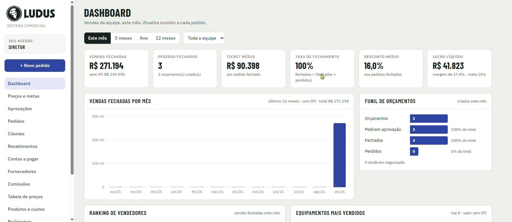

[Manual](../README.md) / Gerencial

# Dashboard

Como ler os indicadores de vendas, o funil de orçamentos e os rankings.

**Índice**

1. Filtros
2. Indicadores
3. Gráficos e rankings

Acesse o menu **Dashboard**. Os números se atualizam sozinhos a cada pedido.

*Dashboard com os filtros de período, os indicadores do mês, as vendas por mês e o funil de orçamentos*

## Filtros

1.  Período: **Este mês**, **3 meses**, **Ano** ou **12 meses**.
2.  Equipe: **Toda a equipe** ou um vendedor.

## Indicadores

| Card | O que mostra |
| --- | --- |
| Vendas fechadas | Total vendido com IPI. O valor sem IPI aparece abaixo. |
| Pedidos fechados | Quantidade de pedidos fechados e de orçamentos criados. |
| Ticket médio | Valor médio por pedido fechado. |
| Taxa de fechamento | Fechados ÷ (fechados + perdidos). |
| Desconto médio | Média dos descontos dos pedidos fechados. |
| Lucro líquido | Lucro dos pedidos fechados, com a margem e a meta. Só para a diretoria. |

## Gráficos e rankings

1.  **Vendas fechadas por mês:** últimos 12 meses, com IPI.
2.  **Funil de orçamentos:** orçamentos criados, que pediram aprovação, fechados, perdidos e ainda em negociação.
3.  **Ranking de vendedores:** vendas fechadas de cada vendedor no período.
4.  **Equipamentos mais vendidos:** top 8, pelo valor sem IPI.

---
*Atualizado em 04/10/2026 · Ávila Ops Tecnologia*
