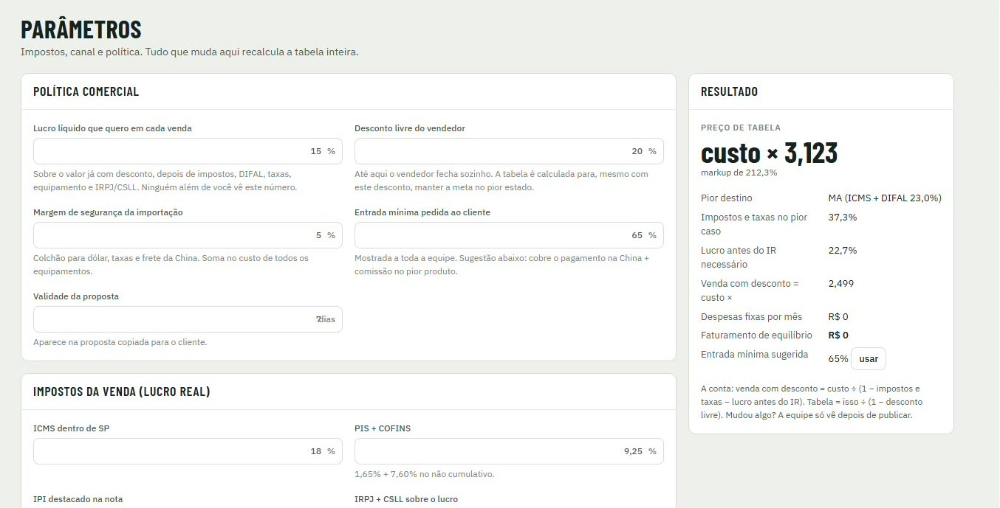
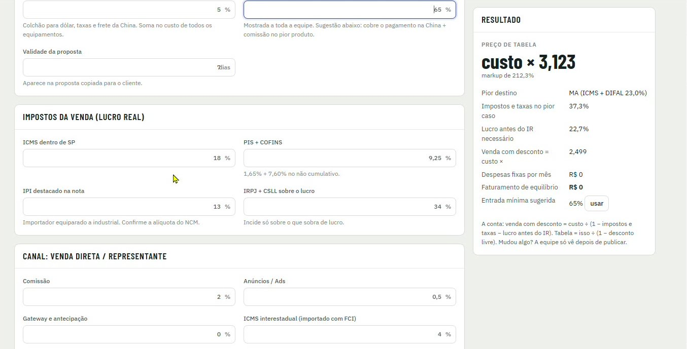

[Manual](../README.md) / Configurações

# Parâmetros

Como ajustar a política comercial, os impostos e os custos do canal que formam o preço de tabela.

**Índice**

1. Política comercial
2. Impostos da venda
3. Canal de venda
4. Resultado
5. Publicar as mudanças

Acesse o menu **Parâmetros**. Esta tela é exclusiva da diretoria. Tudo que muda aqui recalcula a tabela inteira.


*Parâmetros: política comercial e o quadro Resultado com o multiplicador do preço de tabela*

## Política comercial

| Campo | Valor atual | O que faz |
| --- | --- | --- |
| Lucro líquido que quero em cada venda | 15% | Meta sobre o valor já com desconto, depois de impostos, DIFAL, taxas, equipamento e IRPJ/CSLL. |
| Desconto livre do vendedor | 20% | Até aqui o vendedor fecha sozinho. A tabela é calculada para manter a meta mesmo com esse desconto, no pior estado. |
| Margem de segurança da importação | 5% | Colchão para dólar, taxas e frete da China. Soma no custo de todos os equipamentos. |
| Entrada mínima pedida ao cliente | 65% | Mostrada a toda a equipe. O sistema sugere o valor que cobre o pagamento na China, a comissão e o lucro no pior pedido. |
| Validade da proposta | dias | Aparece na proposta copiada para o cliente. |

## Impostos da venda (Lucro Real)


*Impostos da venda e canal de venda direta ou representante*

| Campo | Valor atual | Observação |
| --- | --- | --- |
| ICMS dentro de SP | 18% | Vendas para clientes de SP. |
| PIS + COFINS | 9,25% | 1,65% + 7,60% no regime não cumulativo. |
| IPI destacado na nota | 13% | Importador equiparado a industrial. Confirme a alíquota do NCM. |
| IRPJ + CSLL sobre o lucro | 34% | Incide só sobre o que sobra de lucro. |

## Canal: venda direta / representante

| Campo | Valor atual |
| --- | --- |
| Comissão | 2% |
| Anúncios / Ads | 0,5% |
| Gateway e antecipação | 0% |
| ICMS interestadual (importado com FCI) | 4% |

## Resultado

O quadro Resultado mostra o efeito dos parâmetros: o multiplicador do preço de tabela (ex.: custo × 3,123), o estado de pior caso (ex.: MA, com ICMS + DIFAL de 23%), os impostos e taxas no pior caso, o lucro antes do IR necessário e a entrada mínima sugerida.

```
venda com desconto = custo ÷ (1 − impostos e taxas − lucro antes do IR) preço de tabela = venda com desconto ÷ (1 − desconto livre)
```

Clique em **usar** ao lado da entrada mínima sugerida para adotá-la como política.

## Publicar as mudanças

As mudanças recalculam a tabela na hora para a diretoria, mas a equipe só vê depois da publicação em [Produtos e custos](10-produtos.md).

> **Atenção**
>
> Alíquotas de impostos devem ser confirmadas com o contador da Ludus antes de qualquer alteração.

---
*Atualizado em 04/10/2026 · Ávila Ops Tecnologia*
