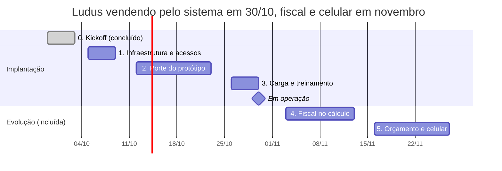

# Roadmap ERP Ludus Equipamentos

Atualizado em 06/10/2026 · Nicolas Avila, Ávila Ops Tecnologia

O ERP da Ludus entra em operação em 30/10/2026, a tempo de a empresa começar a vender em outubro. O ponto de partida é o protótipo que o Rogério montou no Claude, que já tem produtos e custos, pedidos, aprovações, comissões e dashboard. O trabalho é levar esse protótipo para a infraestrutura da Ávila Ops, com login e quatro perfis de acesso em erp.avilaops.com, e depois somar o cálculo fiscal, o orçamento com foto e o uso no celular. O escopo e os valores da proposta comercial seguem como foram aprovados.

## Linha do tempo

O porte do protótipo leva duas semanas por concentrar todas as telas e regras de cálculo. Fiscal e celular ficam depois da entrada em operação para não atrasar o início das vendas e já contam como parte dos 3 meses de evolução. A NF-e fica para depois do certificado A1.

## Fases e entregas

Cada fase termina com uma validação rápida com o Rogério. O protótipo continua sendo a referência: o que ele ajustar no Claude durante o projeto entra na fase em andamento.

| Fase | Período | Entregas | Pronto quando |
| --- | --- | --- | --- |
| 0. Kickoff | 29/09 a 03/10 | Contrato e entrada pagos, acesso de editor ao protótipo, ficha cadastral, logos, pasta de materiais no Drive | Concluída |
| 1. Infraestrutura e acessos | 05/10 a 09/10 | Endereço erp.avilaops.com, servidor em nuvem, banco de dados, login central da Ávila Ops e quatro perfis: diretoria, gerente comercial, vendedor e financeiro | Cada perfil entra e vê só a sua parte do sistema |
| 2. Porte do protótipo | 12/10 a 23/10 | Produtos e custos, tabela de preços, parâmetros, clientes, novo pedido, aprovações, simulador, recebimentos, contas a pagar, fornecedores, comissões e dashboard, com as regras de entrada mínima, comissão de 2% e meta de lucro de 15% | Um pedido de teste faz o caminho completo e os números batem com o protótipo |
| 3. Carga e treinamento | 26/10 a 30/10 | Cadastro dos equipamentos com fotos, códigos e descrições, usuários da equipe, treinamento e entrada em operação | Equipe vendendo pelo sistema a partir de 30/10 |
| 4. Fiscal no cálculo | 03/11 a 13/11 | Cadastro fiscal do produto (NCM, origem importada), ICMS e DIFAL por estado com alíquota interestadual de 4% para importados, impostos separados no custo e no pedido | Cálculo de uma venda para fora de SP confere com o contador |
| 5. Orçamento e celular | 16/11 a 27/11 | Orçamento em PDF com a logo da Ludus e foto pequena de cada equipamento, uso no celular instalável como aplicativo (iOS e Android) | Vendedor monta e envia um orçamento pelo celular |
| 6. Nota fiscal eletrônica | A definir | Emissão de NF-e de entrada e saída integrada ao sistema | Depende do certificado digital A1 da Ludus e da escolha do emissor de NF-e |

## Pagamentos e pós-implantação

A implantação foi fechada em 4 parcelas de R$ 1.000,00 por Pix, e a mensalidade de R$ 350,00 começa junto com a entrada em operação.

| Vencimento | Implantação | Mensalidade | Situação |
| --- | --- | --- | --- |
| 29/09/2026 | R$ 1.000,00 |  | Pago |
| 30/10/2026 | R$ 1.000,00 | R$ 350,00 | A vencer |
| 30/11/2026 | R$ 1.000,00 | R$ 350,00 | A vencer |
| 30/12/2026 | R$ 1.000,00 | R$ 350,00 | A vencer |

Os 3 meses de atualizações e ajustes incluídos vão de 30/10/2026 a 30/01/2027. Nesse período entram as fases 4 e 5 e os pedidos de mudança do Rogério, enviados como resposta copiada do Claude ou pelo modelo de solicitação.

Para depois, quando a empresa crescer: CRM integrado ao WhatsApp Business com um número por vendedor, sistema da Coliseu e e-commerce.

## Pendências e riscos

| Pendência | Quem | Afeta | Observação |
| --- | --- | --- | --- |
| Colocar o sistema no ar em erp.avilaops.com | Ávila Ops | Fase 1 | Decidido em 06/10: o sistema fica no endereço da Ávila Ops; os domínios da Ludus são para o site institucional |
| Lista de usuários com nome, e-mail e perfil | Ludus | Fase 1 | E-mails corporativos ainda a combinar |
| Fotos dos equipamentos com código e descrição | Ludus (videomaker) | Fase 3 | Enviar também o catálogo completo da China |
| Entrada mínima da equipe: manter 65% ou subir para 70% | Rogério | Fase 2 | A regra nova sugere 70% no pior caso |
| Tabela de DIFAL para mercadoria importada (4%) | Contador da Ludus | Fase 4 | A tabela recebida é de itens nacionais (7% e 12%) |
| Regime tributário, créditos na entrada e se academia é não contribuinte | Contador da Ludus | Fase 4 | Define quando o DIFAL fica com a Ludus |
| Certificado digital A1 e emissor de NF-e | Ludus e Ávila Ops | Fase 6 | Custos próprios, fora da mensalidade |

O maior risco é o prazo de 30/10 para começar a vender. Ele depende do servidor no ar e dos usuários na primeira semana e das fotos até 26/10. Mudanças grandes pedidas durante a fase 2 vão para os 3 meses de evolução, para não atrasar a entrada em operação.

## Checklist de acompanhamento

- [x] Proposta aprovada e entrada paga
- [x] Acesso ao protótipo, ficha cadastral e logos recebidos
- [ ] Servidor no ar em erp.avilaops.com
- [x] Login com os quatro perfis funcionando
- [ ] Protótipo portado e validado com um pedido de teste
- [ ] Equipamentos cadastrados com fotos
- [ ] Equipe treinada e sistema em operação (30/10)
- [ ] ICMS e DIFAL de importados validados com o contador
- [ ] Orçamento em PDF com foto e uso no celular
- [ ] Decisão sobre NF-e (certificado A1 e emissor)
- [ ] Fim dos 3 meses de evolução (30/01/2027)
